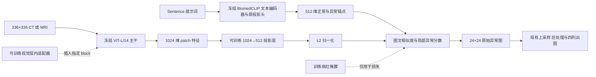

# BiomedCLIP 文本侧与 ViT-L/14 视觉侧整合实验修改方案

编写日期：2026-10-04  
对应代码：`D:\图神经网络\小样本原型学习\PA-clip新设计2\paclip`  
状态：**实施方案，尚未修改模型或训练代码；文中的新增参数、接口和命令需要实现后才能使用。**

## 1. 本次实验要验证什么

保留 BiomedCLIP 的医学文本编码器、tokenizer 和文本投影头，将视觉编码器替换成预训练的 OpenCLIP ViT-L/14。冻结两侧预训练主干，利用少量有病灶掩膜的数据，训练新增的视觉到文本投影层及视觉层内适配器，验证病灶定位是否改善。

这里的“保留文本侧”分为两种情况，第一版明确选择第一种：

1. **第一版：原始预训练 BiomedCLIP 文本侧完全冻结。** 继续使用胸腺瘤 `sentence`、脑 MRI `brain_mri_sentence` 的提示词内容，关闭随机初始化的输出端文本适配器，不训练文本层内适配器。
2. 后续可选：加载已经训练好的 BiomedCLIP 文本适配器，并冻结或继续微调。必须记录其来源、训练样本与 K，不能把使用过更多样本的旧文本权重当作本轮纯 K-shot 初始化。

不需要重新预训练 CLIP。第一版不增加医学图文预训练数据，不要求每张图像有报告或描述；训练监督来自现有病灶掩膜。

需要验证的是当前任务上的视觉—文本匹配与定位能力，不能把少量固定提示词的局部训练解释成恢复了通用的医学图文检索能力。

## 2. 固定第一版配置，控制实验变量

本方案按租用单张 GPU 设计，不以本机 8 GB 显存限制主实验。当前代码参考环境为 `torch-gpu1`：`open_clip_torch=3.3.0`、`timm=1.0.30`、`transformers=5.14.1`、`torch=2.12.0.dev20260408+cu128`。这些是本机实测版本；租卡环境应锁定经冒烟测试通过的依赖，不要求复刻 nightly PyTorch 或随意升级。

第一轮采用以下配置。学习率、训练步数属于试验起点，需要在训练/验证集上确认，不代表已经验证的最优值。

| 项目 | 第一版取值 |
|---|---|
| 文本模型 | `hf-hub:microsoft/BiomedCLIP-PubMedBERT_256-vit_base_patch16_224` |
| 文本编码器及原投影头 | 冻结，输出 512 维 |
| 视觉模型 | `ViT-L-14-336-quickgelu` |
| 视觉预训练权重 | `openai`；也允许已下载的同架构本地权重 |
| 输入图像 | 336×336，完整视野缩放，优先从原始图像重新生成 |
| 视觉主干 | 24 层，隐藏宽度 1024，冻结 |
| patch 网格 | 24×24，共 576 个 patch；另外有 1 个 CLS token |
| 视觉特征提取层 | `[23]`，0 起索引，即第 24 层 |
| 新增投影层 | 共享 `Linear(1024, 512, bias=False)` |
| 视觉层内适配器位置 | blocks `[17, 20, 23]`，每层 attention 残差后与 FFN 残差后各一个 |
| 适配器瓶颈宽度 | 64 |
| 适配器残差系数 | 初始 0.1；第一版沿用已有可学习系数实现 |
| 三组文本锚点融合 | 固定等权，不在第一版额外训练融合参数 |
| 文本提示词 | 胸腺瘤 `sentence`；脑 MRI `brain_mri_sentence` |
| 图像级输出 | `local_topk`；`topk_ratio=0.05` |
| 全局 CLS 分类损失 | 第一版统一设为 0 |
| 初始训练配置 | 2000 次优化器更新；H-PV 组前 200 次只训练投影层 |
| 单卡训练起点 | 24 GB 显存；micro-batch=4，梯度累积 2 次，有效 batch=8 |
| 混合精度 | 优先 BF16，启动时检测支持性；不支持则 FP16+GradScaler |

主实验选用原生 336 权重及 336 输入，不为适配本机而降低分辨率。ViT-L/14 的 `/14` 是 patch 边长；336/14=24，网格是 24×24。

224 输入的 `ViT-L-14-quickgelu` 与配套 `openai` 权重保留为独立对照（16×16 网格），用于分辨率/模型变体分析与轻量工程调试。主实验直接加载原生 336 权重，不需要将 224 权重的位置编码临时插值成 336。

AA-CLIP、MadCLIP 官方入口采用 `ViT-L-14-336` 与 `openai` 权重；它们代码的实际输入尺寸分别另有设置（当前入口默认 518 与 240），因此“采用 ViT-L/14”不等于完整复现其协议。本方案采用同系列 336 预训练变体，但用 336 输入进行混合编码器实验，具体训练损失和输入协议并非这两篇工作的完整复现。[AA-CLIP 入口](https://github.com/Mwxinnn/AA-CLIP/blob/main/train.py)、[MadCLIP 入口](https://github.com/mahshid1998/MadCLIP/blob/main/train.py)。

`quickgelu` 用于显式匹配 OpenAI CLIP 预训练的激活函数。不得把随机初始化的 ViT-L 或使用错误激活函数的模型当作成功加载。启动时核对实际模型类型、激活函数与权重加载报告。[OpenCLIP 预训练配置](https://github.com/mlfoundations/open_clip/blob/main/src/open_clip/pretrained.py)、[336 架构配置](https://github.com/mlfoundations/open_clip/blob/main/src/open_clip/model_configs/ViT-L-14-336-quickgelu.json)。

### 2.1 租卡配置与预算口径

**推荐首轮：单张 RTX 4090 24 GB，8～16 vCPU，64 GB 系统内存，至少 200 GB 可用 SSD，数据另计。** 32 GB 系统内存可作为已预处理 2D 切片的较低起点；原始 NIfTI 解压和多 worker 预处理更建议 64 GB。

| 方案 | GPU 与主机 | 适用场景 |
|---|---|---|
| 推荐首轮 | 1×RTX 4090 24 GB；8～16 vCPU；64 GB RAM | 336 输入、冻结主干、bridge＋6 个视觉 adapter；从 micro-batch=4、累积 2 起步 |
| 更宽裕 | 1×RTX 6000 Ada 48 GB；16 vCPU；64 GB RAM | 之后同时训练文本适配器、多层特征或更高分辨率；可尝试 micro-batch=8、累积 1，仍以实测为准 |
| 多实验并行 | 多张独立 GPU，每张卡跑一个 seed/实验 | 加快消融；首版无需给单个 few-shot 实验引入分布式训练 |

GPU 显存规格依据：[RTX 4090 官方规格](https://www.nvidia.com/en-us/geforce/graphics-cards/40-series/rtx-4090/)、[RTX 6000 Ada 官方规格](https://www.nvidia.com/en-us/products/workstations/rtx-6000/)。表中“适合本任务”的判断为本方案容量估计，尚无本项目的实际峰值显存测量。首轮不需要以 A100/H100 或多卡作为前提。

磁盘预算分开统计：200 GB 是环境、下载缓存、预处理副本、checkpoint 和图像结果的起点；还需加上原始 CT/MRI 体积。若每个 seed 保存多个完整主干 checkpoint，空间会迅速增加，优先选择可验证基座引用的增量 checkpoint，或仅保留最后与验证集选出的最佳权重。

显存/时间验收：在 projector 与 visual 两阶段各测完整 forward+backward+optimizer step，CUDA 同步后记录 `max_memory_allocated` 和 `max_memory_reserved`。先预热，再统计稳定的 20 次更新耗时；正式耗时按“两阶段各自步数×实测每步时间＋校准/评估/导出时间”估算。不得把单纯前向的显存或速度当作训练需求。

租卡环境推荐 Linux、Python 3.10/3.11 与兼容 CUDA 的 PyTorch 镜像。复用模型权重缓存，锁定 OpenCLIP/timm/Transformers 版本并跑接口验收；本机绝对路径转换为显式数据根目录，不依赖 Windows 盘符。

## 3. 模型结构与张量契约



### 3.1 选择主干特征直接投影

第一版统一取 ViT-L 最后一层、经过其冻结 `ln_post` 的 **1024 维 patch token**，经过新投影层映射到 512 维。

不使用 ViT-L 原来的 1024→768 图文投影作为新视觉匹配路径。该原投影可以保留为冻结参数以便加载，但 `forward` 的异常图不依赖其输出。

`1024→512` 和 `768→512` 是两种可选设计，第一版只实施前者。若以后对照后者，要使用不同的 `projection_input_space` 和实验标识，不能加载前者的投影权重。

### 3.2 输入输出尺寸

| 对象 | 336 主实验形状 |
|---|---|
| 输入图像 | `[B, 3, 336, 336]` |
| block 内 token | `[B, 577, 1024]`，以实际 API 的 batch-first 契约为准 |
| 提取的 patch token | `[B, 576, 1024]`，已经移除 CLS |
| 投影后 patch | `[B, 576, 512]` |
| 每组正常/异常文本锚点 | 各 `[512]` |
| `patch_logits` | `[B, 2, 24, 24]` |
| `patch_logits_per_level` | `[B, L_text, 2, 24, 24]` |
| `anomaly_map` | `[B, 24, 24]` |
| 训练掩膜 | `[B, 24, 24]`，0/1 |

`L_text` 是提示词组数；它与视觉特征提取层数是两个概念。当前文本三组锚点仍保留，第一版视觉只取最后一层。

定义：

```python
v = normalize(bridge(patch_tokens.float()), dim=-1, eps=1e-6)
t_n = normalize(normal_anchor.float(), dim=-1, eps=1e-6)
t_a = normalize(abnormal_anchor.float(), dim=-1, eps=1e-6)
normal_similarity = v @ t_n
abnormal_similarity = v @ t_a
logits = stack([normal_similarity, abnormal_similarity], dim=class_axis) / temperature
raw_margin = abnormal_similarity - normal_similarity
```

与当前后处理接口保持一致：`anomaly_map` 返回**尚未除以温度的相似度差**；后处理继续用 `sigmoid(raw_margin / temperature)`。不要在模型中先除温度，然后在后处理中再除一次。

三组文本锚点的 logits 与 raw margin 分别按同样的固定权重融合。这样 `softmax(patch_logits)` 的异常分数与 `sigmoid(raw_margin / temperature)` 对应。

### 3.3 投影层初始化

```python
self.visual_to_biomed = nn.Linear(1024, 512, bias=False)
nn.init.xavier_uniform_(self.visual_to_biomed.weight)
```

不得把这个层零初始化。它是跨空间的主映射，零输出再归一化会使初始表示与梯度行为不合理。零初始化只用于已有残差适配器的 `up` 层，使其初始为恒等映射。

第一版使用所有 patch 共享、所有文本属性共享的一个投影层，不为正常/异常各建一个映射。该层有 524,288 个参数。

第一版每个器官独立运行、独立保存模型。若以后支持同一个实例切换多个器官，投影层也必须按器官管理或明确共享训练；仅切换适配器而共享一个不断更新的投影层，不能保证旧器官行为保持不变。

## 4. 针对当前代码的文件修改清单

以下路径相对于本文所在目录。

| 文件 | 修改内容 |
|---|---|
| `text_side_anomaly/config.py` | 增加 backbone 类型、独立视觉模型/权重、投影配置、输入几何和混合模型阶段配置 |
| `text_side_anomaly/model.py` | 分支加载混合模型、分发图像前向、投影、冻结规则、优化器、架构与 checkpoint |
| **新增** `text_side_anomaly/openclip_visual.py` | 封装原生 OpenCLIP 视觉特征提取，统一返回 patch、CLS、网格 |
| **新增** `text_side_anomaly/openclip_visual_adapter.py` | 为原生 OpenCLIP block 安装 attention/FFN 残差后适配器 |
| `text_side_anomaly/visual_inlayer_adapter.py` | 保留现有 timm 实现，增加明确的后端分发或由模型选择新安装器 |
| `text_side_anomaly/inlayer_adapter.py` | 复用 `InLayerBottleneckAdapter`/`OrganAdapterBank`；不改 Biomed 文本安装路径 |
| `text_side_anomaly/dataset.py` | 用统一数据几何配置生成图像、patch 掩膜与 ROI；覆盖 2D、3D、固定切片三个路径 |
| `text_side_anomaly/thymoma_dataset.py` | 从高分辨率掩膜生成指定 grid；支持版本化缓存和稳定 sample/case ID |
| `prepare_thymoma_slices.py` | 新缓存保留明确的高分辨率二值 GT、几何元数据、source/case/z；支持 336 重新提取 |
| `prepare_brain_mri_slices.py` | 检查分辨率、二值标注、样本 ID 与序列信息的输出契约 |
| `text_side_anomaly/train.py` | 配置分发、去除 `image_size=224, grid=14` 硬编码、两阶段训练、AMP/累积、身份与恢复 |
| `thymoma_local.py` | 接入同一混合模型工厂、训练阶段、输入预处理及校准路径 |
| `fewshot_run.py` | 加 H-P/H-PV 模式、`npz_dir` 参数和固定支持集导入导出；更新身份字段 |
| `brain_fewshot_run.py` | 加混合模型实验组，完整传递配置；K 保持正常与异常合计 |
| `text_side_anomaly/losses.py` | 首版保留局部 CE，检查 mask/grid 一致；权重为 0 的分支允许跳过计算 |
| `text_side_anomaly/inference.py` | 使用统一输入与真实灰度；导出真实标签、预测标签、模型与几何元数据 |
| `generate_heatmaps.py` | 根据 checkpoint 重建模型和预处理，禁止默认当成 Biomed 视觉塔 |
| `text_side_anomaly/postprocess.py` | 不改数值算法；检查任意 grid 输入与温度只应用一次 |
| `text_side_anomaly/metrics.py`、`visualize.py` | 用共同评估空间比较指标；掩膜/GT/图片变换一致 |
| `tests/` | 增加原生 block、混合模型梯度、数据网格、checkpoint、端到端冒烟测试 |

现有 `model.py::encode_image()` 依赖 `clip.visual.trunk` 与 `.head`；现有安装器限定 `timm.models.vision_transformer.Block`。更换模型名无法解决这些接口差异，必须实现上面的分发。

## 5. 配置与模型加载

### 5.1 新增配置字段建议

```python
backbone_type = "biomedclip"  # 旧模式；新模式为 hybrid_biomed_vitl14
visual_model_name = "ViT-L-14-336-quickgelu"
visual_pretrained = "openai"
visual_backend = "openclip_native"
image_size = 336
visual_feature_layers = [23]
projection_input_space = "native_hidden_ln_post"
projection_in_dim = 1024
projection_out_dim = 512
projection_bias = False
text_policy = "pretrained_frozen"
hybrid_mode = "projector_visual"  # 或 projector
projector_warmup_steps = 200
projection_lr = 1e-4
visual_adapter_lr = 1e-4
micro_batch_size = 4
grad_accum_steps = 2
amp_dtype = "bf16"
preprocess_version = "aligned_mask_v2"
eval_image_size = 224
```

继续保留 `model_name` 作为原 BiomedCLIP 文本基座名称，不能用它同时表示两个来源。`visual_hidden=1024` 只作用于新视觉侧；Biomed 文本层内宽度仍为 768，投影后仍为 512。

模型工厂应先解析一份统一的 geometry/spec，再创建训练、验证、测试数据集。禁止各入口独立猜测 grid。至少包含 `image_hw`、`patch_hw`、`grid_hw`、插值、归一化和评估尺寸。

### 5.2 加载顺序和显存

第一版可保留现有 `self.clip` 作为组合容器，以兼容 Biomed 文本安装路径：

1. 在 CPU 加载原 BiomedCLIP，冻结原参数。
2. 在 CPU 通过 `open_clip.create_model_and_transforms()` 加载指定 OpenAI 权重的 ViT-L 模型，设置 `device="cpu"`、`precision="fp32"`，明确要求预训练权重存在。
3. 取出 donor 的 `.visual`，替换 `self.clip.visual`；清理不再使用的原 Biomed 视觉塔引用和 donor 文本塔引用。
4. `self.clip.encode_text()` 与原 Biomed tokenizer 继续工作；混合模式禁止调用旧的整模型图文 `forward()` 或原 `encode_image()` 假定其返回 512 维。
5. 冻结新的视觉主干，再创建投影层、安装视觉适配器，应用训练阶段。
6. 只将本次需要的模块移动到 CUDA。第一版文本固定，可先在 CPU 计算全部锚点并搬到 CUDA，避免整个文本塔常驻 GPU。

不要先把两套完整 CLIP 都放入 GPU 再拆分。不要直接复制原 Biomed 的视觉投影头：其输入宽度为 768，与新主干 1024 不符。

必须记录实际权重来源、revision 或文件 SHA256、库版本及激活函数。如果下载失败或参数缺失，立即报错，禁止退回随机权重。

## 6. 原生 OpenCLIP 视觉前向

当前安装的 OpenCLIP 3.3.0 已提供 `VisionTransformer.forward_intermediates()`。建议在新文件中包装此接口，避免手写 patch embedding、位置编码和整套 Transformer 循环。

语义示例，需与最终安装版本的返回字段核对：

```python
features = visual.forward_intermediates(
    images,
    indices=[23],
    normalize_intermediates=True,
    intermediates_only=True,
    output_fmt="NLC",
    output_extra_tokens=True,
)
patch = features["image_intermediates"][0]          # [B, 576, 1024]
cls = features["image_intermediates_prefix"][0]    # [B, 1, 1024]
```

关键约束：

- 此接口已经把 CLS 和 patch 分开，不能再对 `patch[:, 1:]` 切一次。
- `normalize_intermediates=True` 已应用 `ln_post`，不能再重复应用。
- 本接口返回的中间特征没有经过原来的 `.proj`；与本方案 1024→512 的入口一致。
- 原生 OpenCLIP 参数名不是当前 timm 的 `norm=True`，不要直接复制现有调用。
- 检查实际网格来自视觉模型的 patch size 与输入尺寸；第一版要求高宽整除 patch size。
- backbone 保持 eval，patch dropout 为 0，不能使训练时 token 数随机减少。
- 第一版不使用额外的 DPAM、attention surgery 或 patch 特征缓存来改变模型行为。

`forward()` 返回字段尽量保持旧协议，保证 loss、推理与后处理复用。可通过同一个 bridge 产生 CLS 特征以满足兼容接口，但 `cls_probs` 在首版没有图像级监督，必须标记为不可用于正式全局融合。

可增加 `model.output_spec()` 返回空间尺寸和特征维度，用于 dataset 与运行时断言；不要为了查询这些值先执行训练模式前向。

## 7. 视觉层内适配器的安装与梯度

### 7.1 插入位置

原生 block 路径：`clip.visual.transformer.resblocks`。第一版选择 0 起索引 `[17,20,23]`，每层两处，共 6 个适配器，均作用于包括 CLS 在内的全部 token。

以本机 `ResidualAttentionBlock` 为准，需保留原有归一化、attention、LayerScale、mask 和返回类型：

```python
x = q_x + block.ls_1(block.attention(
    q_x=block.ln_1(q_x), k_x=k_x, v_x=v_x, attn_mask=attn_mask,
))
x = adapter_after_attention(x)
x = x + block.ls_2(block.mlp(block.ln_2(x)))
x = adapter_after_ffn(x)
return x
```

上面是位置说明，不是可跨所有 OpenCLIP 版本粘贴的完整函数。实现时必须保留原函数对 `k_x/v_x` 的归一化处理，严格转发签名，并检查 block 类型。第一版仅支持确认过的原生 self-attention `ResidualAttentionBlock`；遇到其他结构明确报错。

推荐沿用现有“保存原 forward、安装、记录命中、卸载”的管理方式。避免把同一份 adapter bank 同时注册到多个父模块导致 checkpoint 重复键或参数集合难以审计。

### 7.2 适配器公式

`h_out = h + λ · W_up(GELU(W_down(h)))`，其中 `W_down:1024→64`，`W_up:64→1024`。

复用已有 `InLayerBottleneckAdapter(d_model=1024, bottleneck=64)`，`W_up=0`、`λ=0.1`。不能把 λ 和 W_up 同时初始化为 0。

按当前带 bias、可学习 λ 的实现，6 个适配器约 79.3 万参数，加 bridge 合计约 131.7 万参数。实际参数量必须启动时打印，不把冻结 ViT-L 参数算入可训练数量。

### 7.3 冻结不等于禁止梯度经过

视觉主干参数设 `requires_grad=False`。当视觉层内适配器训练时，**不能将整个视觉前向包进 `torch.no_grad()`，也不能对提取特征 `.detach()`**，否则适配器无法收到局部损失的梯度。

只训练 bridge 的阶段可以用 `no_grad` 提取视觉特征。进入视觉适配器训练阶段后必须恢复梯度路径。固定文本锚点可以始终缓存，其缓存键包含提示词内容、tokenizer、文本权重与文本策略。

零初始化的 up 层可能使第一次 backward 时 down 层梯度为 0。验收应检查第一步 up 梯度，更新后再检查 down 梯度，不能要求初始时所有参数梯度都非零。

### 7.4 层选择

第一版只提取第 24 层特征，保证所选 3 层适配器都在损失的上游，并减少同时改变多尺度策略带来的混淆。

后续可对照 `visual_feature_layers=[17,20,23]`，在经过同一 bridge 与归一化后等权融合，再归一化。应固定并记录融合顺序。

若改为论文常见的 `[5,11,17,23]`，要认识到前两组特征位于当前首个适配器之前，其损失不会更新后面的适配器。需要配套调整适配器位置或明确它们只训练 bridge，不能把每层都计成视觉适配器监督。

## 8. 数据与标注几何：本次必改项

### 8.1 胸腺瘤缓存

当前 `.npz` 包含 `image:224×224`、`mask:14×14`、`mask224:224×224`。新模型不能继续用旧 `mask` 监督 24×24 输出。

新加载规则：

1. 优先使用新缓存中的高分辨率二值 `gt_mask`；兼容旧缓存的 `mask224`。
2. 对齐图像和 GT 的空间变换，得到 `mask_input`，大小与实际模型输入一致。
3. 再从 `mask_input` 下采样到模型 patch grid。
4. 缺少高分辨率掩膜时，局部监督训练明确报错，禁止把旧 14×14 掩膜放大成 24×24（或 224 对照的 16×16）并声称获得新标注。

默认下采样采用与现有胸腺瘤思路一致的“patch 内存在任一病灶像素即为正”：

```python
# mask_input 已经是 [H, W] 的 0/1 二值张量，且 H、W 能被 14 整除。
mask_patch = F.max_pool2d(
    mask_input[None, None].float(), kernel_size=14, stride=14,
)[0, 0].long()
```

224 输入得到 16×16，336 输入得到 24×24。不要混用面积平均阈值和最大池化；若以后比较另一种规则，应单独记录 `mask_downsample_policy`。

GT 的几何缩放使用最近邻，图像用已确定的连续插值。旧预处理用过双线性缩放 GT 再阈值，可能丢失小病灶；正式对照优先从原始 ROI 重新生成二值高分辨率标注，再对全部组使用同一新标注版本。已经在旧 `mask224` 中消失的细小标注无法通过新加载器恢复。

第一版允许利用旧 224 缓存做接口冒烟；正式实验需记录是否使用旧缓存，并对异常样本检查下采样后的正 patch 数。非空 GT 变成空 patch 掩膜必须记录/处理，不能静默当作背景样本。

### 8.2 336 主实验的数据要求

推荐从原始 NIfTI/图像与 ROI 重新生成 336 图像，不把 224 缓存简单放大后称为增加了原始细节。确需放大旧缓存时，记录 `source_image_size=224`，结果仅作为输入尺寸实验。

缓存建议增加：`schema_version`、`sample_id`、`case_id`、`slice_z`、`source_image_size`、`model_image_size`、`mask_policy`、`preprocess_version`。输出至新目录，保留旧实验数据。

### 8.3 脑 MRI

当前 `train.py` 构造 dataset 时有明确的 `image_size=224, grid=14` 硬编码，须从统一 geometry 传入。覆盖 `SliceAnomalyDataset`、`VolumeAnomalyDataset`、`VolumeFixedSliceDataset` 和 ROI 下采样。

异常样本缺少 GT 时，不得创建零掩膜并将其用于局部监督；应沿用已有标注可用性校验，必要时拒绝本次局部训练。正常样本可用可靠的正常标签生成空目标掩膜。

脑 MRI 的 K 继续表示正常与异常合计 K 个支持样本，保持既有切片/体积口径与固定 z 策略。不能因换视觉模型再次随机抽取一套更有利的支持集。

### 8.4 预处理与可视化

使用所选视觉权重的 mean/std；原 Biomed tokenizer 不变。模型需要的图像变换与 mask/ROI 变换必须共享几何参数。

第一版沿用完整视野方形缩放，不直接使用带 center-crop 的默认分类 transform 去处理图像而遗漏 GT 同步裁剪。记录这是项目的定位预处理策略。

显式保留 `gray01`，不要在新入口依赖 `inference.py` 对默认 mean/std 的反归一化猜测。

第一版所有组在共同的 **224×224 评估空间**上计算正式像素指标和掩膜 Dice/IoU；336 主实验的预测也对齐到同一空间。若另报原始分辨率结果，应所有组一起计算并单独命名，不能拿不同尺寸的 patch Dice 当成同口径对比。

GT 仅用于训练、验证选择和评估叠图。测试时不能通过 GT 选择输入切片、裁剪位置或生成预测；若历史胸腺瘤基准就是预选病灶切片，应明确报告它只衡量该集合上的定位能力。

## 9. 训练阶段与冻结表

### 9.1 两组混合模型实验

| 组名 | 含义 | 阶段 |
|---|---|---|
| H-P | Biomed 文本＋ViT-L 视觉，只训练投影层 | 全程 `projector` |
| H-PV | 同上，增加视觉层内适配器 | 先 `projector`，再 `visual` |

新增 `projector` 阶段，不把它伪装成当前 `text` 阶段。现有 `set_train_stage()`、参数断言与优化器构造都必须认识这个阶段。

| 模块 | projector 阶段 | visual 阶段 |
|---|---|---|
| Biomed 文本主干及原投影头 | 冻结 | 冻结 |
| 原输出端文本 adapter | 关闭且冻结 | 关闭且冻结 |
| 文本层内 adapter | 首版不安装 | 首版不安装 |
| ViT-L 主干与原 `.proj` | 冻结 | 冻结 |
| 新 bridge | 训练 | 训练 |
| 视觉层内 adapter | 不安装或旁路且冻结 | 激活并训练 |
| 文本属性融合权重 | 固定等权 | 固定等权 |

旧 Biomed 模式的 `text/visual/joint` 行为不应因新增 projector 模式发生改变。

### 9.2 首次运行参数

H-P：2000 optimizer steps 全部训练 bridge。  
H-PV：前 200 optimizer steps 训练 bridge，随后 1800 steps 同时训练 bridge 与视觉适配器。总预算仍为 2000，不能变成 200+2000。

`projector_warmup_steps` 必须满足 `0 <= warmup < total_steps`；H-P 的专用模式忽略预热逻辑，要求该参数为 0。先用 10 steps、其中 2 steps 预热执行工程冒烟，再启动正式预算。

AdamW 起点：bridge LR=1e-4，adapter LR=1e-4，weight_decay=1e-5。bias、λ 等标量不做 weight decay。所有实际参数组写入日志。

阶段切换时保持 bridge 的 Adam 状态，推荐将已有 optimizer 增加视觉适配器参数组，并重建“optimizer 参数集合与可训练集合一致”的断言；如选择重建 optimizer，则显式迁移 bridge 状态。不能静默清空 bridge 动量。

前期冻结文本时 `w_text=w_div=w_level=0`，`w_local=1`、`w_global=0`。第一版保持局部 CE，后续再做 CE+Dice/Focal 对照，避免把新损失与换骨干的收益混在一起。

没有正常胸腺瘤病例不会阻止此局部训练：病灶掩膜内外提供 patch 的正负监督。不过病灶外不等同于健康患者，不能据此宣称正常病例误报率已经验证。

### 9.3 AMP、梯度累积与显存

- 前向使用 autocast，参数保持 FP32；归一化、相似度和损失可在 FP32 计算。
- BF16 先通过 `torch.cuda.is_bf16_supported()` 检测，FP16 使用 GradScaler；首版无需手工把整个模型 `.half()`。
- 默认一个 optimizer step 累积 2 个 micro-batch，每个 backward 的 loss 除以 2；每次更新前只 zero_grad 一次。若改为 micro-batch=2、累积 4 次，loss 除以 4。
- 以 optimizer steps 计预算、日志与 checkpoint；不要把 micro-step 当作训练步数。
- 有效 batch=8 必须由实际累计样本数验证。使用固定长度、有放回的支持集采样器，确保每个 micro-batch 达到配置大小；K 小于 batch 时允许从同一支持集重复抽样，增强不计为新增支持样本。不能让不足 batch 的尾批静默改变有效 batch；另一实现若接收变长 batch，需按实际样本数累计/归一化并记录。
- 第一版关闭 gradient checkpointing。若租用配置上的峰值显存不满足目标 batch，再启用通过测试的非重入 checkpoint 路径；hook 在重算中可能多次命中，不能用训练命中次数判断样本数。
- 显存不足时先降低 micro-batch 并同步增加累积，保持有效 batch=8；再考虑 checkpointing 或更大显存。减少适配器层数/输入分辨率属于改变实验，不能静默执行。

冻结参数不代表没有中间激活开销。推荐 24 GB 是针对本方案结构的容量估计，实际峰值须在真实 ViT-L、数据尺寸、精度与 backward 条件下测量；尚未实测，不把估计写成通过记录。

## 10. 小样本与公平对照

建议按以下顺序执行，先工程通过，再比较有效性：

1. 单个 K、单个 seed 的 10-step 冒烟。
2. K=10、seed=0，固定 2000 optimizer steps 比较 H-P 与 H-PV。
3. 如训练与验证正常，再扩展 K∈{5,10,20}，seed∈{0,1,2}。

上述 K 是建议试验值，可沿用现有 K 列表。胸腺瘤 K 仍按当前支持切片总数与病例优先抽样策略，脑 MRI K 仍按正常与异常合计；不要自动套用某论文“每类 K 张”的口径。

至少保留这些结果：

| 组 | 配置 | 作用 |
|---|---|---|
| B-current | 当前 BiomedCLIP 最佳已确认方案 | 与当前系统比较整体效果 |
| B-V | 原 Biomed 双塔，原始文本固定，只训练视觉适配器 | 更接近新方案的文本冻结策略；按同预算重跑 |
| H-P-336 | 新混合模型，336 输入，仅 bridge | 判断固定 ViT-L 特征的可用性 |
| H-PV-336 | 新混合模型，336 输入，bridge＋视觉层内适配器 | 主要尝试方案 |
| H-P-224 / H-PV-224 | 对应的原生 224 权重与 224 输入 | 与当前 224 输入基线做尺寸匹配的对照 |

同一输入尺寸下的 H-P 与 H-PV 可以直接比较适配器收益。B-current 与 H-PV-336 的差异包含骨干、投影、文本训练策略和输入分辨率变化，不能把全部差异归因于 ViT-L 容量。若要声称换骨干带来收益，至少补充 H-PV-224 与现有 224 基线的对照。原生 224 与 336 分支还使用了各自预训练权重，两者之差应表述为模型变体与输入尺寸的组合变化；若要严格隔离输入分辨率，另做同一 checkpoint 的位置编码插值实验，并单独登记协议。

若要进一步解释医学文本的作用，可增加“完整配套 ViT-L CLIP＋同类视觉适配器”组，并另行记录其 tokenizer 与文本空间。

每组复用完全一致的病例划分、支持样本 ID、z 切片、增强策略、验证集和测试集。分辨率变动时不能因新缓存路径导致支持集重新抽样，应通过稳定 source/sample ID 对齐。

保存 `support_manifest.json`，记录 K、正常/异常数量、病例数、所有样本 ID、mask 可用性和哈希。旧 checkpoint 或文本适配器的支持集不能混入验证/测试病例。

验证集标注用于选阈值，也属于实验使用的监督，应报告其规模。若以后声称“总共只使用 K 个标注样本”，则需把验证标注纳入预算或采用预先固定阈值协议；不能只统计反向传播的 K。

## 11. checkpoint、缓存与独立推理

### 11.1 新架构信息

混合模型建议采用新的 format version（例如 v3），旧 v2 保持可读。不能简单修改 `_is_v2_checkpoint()` 的常量后让旧权重全部失效；训练、出图、评估入口应统一走格式识别与模型工厂。

至少保存：

```text
backbone_type
text_model_name / text_weight_revision_or_hash / tokenizer_identity
visual_model_name / visual_pretrained / visual_weight_hash / activation
visual_backend / visual_hidden / projection_input_space
projection_in_dim / projection_out_dim / projection_bias
visual_feature_layers / visual_adapter_layers / positions / bottleneck / lambda_policy
image_hw / patch_hw / grid_hw / eval_image_hw
normalization / interpolation / mask_downsample_policy / preprocess_version
text_policy / prompt_set / prompt_digest / text_adapter_source
hybrid_mode / current_stage / warmup_steps / completed_optimizer_steps
micro_batch_size / grad_accum_steps / amp_dtype / optimizer_groups
support_manifest / split_identity / seed / global_supervision_enabled
```

权重包含 bridge、所有安装的适配器以及固定参数或可验证的基座引用。若只保存增量权重，加载时必须验证基座身份；不能依赖一个会变化的远端 `main` 名称恢复全部实验。

独立推理必须从 checkpoint 得出 backend、grid、归一化和文本路由。与命令行冲突的结构参数应报错，不能默默优先某一侧。

精确续训还需 optimizer、GradScaler（如有）、scheduler（如有）、RNG 和采样器/迭代位置。checkpoint 只在完整 optimizer step 边界保存，避免丢失半个累积窗口。

### 11.2 初始化和旧权重

- 原 Biomed 的视觉适配器是 768 宽，新 ViT-L 是 1024 宽，禁止直接加载。
- `allow_missing_visual` 不能作为忽略全部 shape mismatch 的开关。
- 新实验默认使用原始预训练文本，不能从旧 checkpoint 不加选择地恢复 optimizer 或视觉 bank。
- 如单独导入同架构 Biomed 文本适配器，只允许白名单文本键，并保存导入报告、来源哈希和监督预算。

### 11.3 三种身份

训练身份必须增加全部 backbone、权重、投影、输入几何、训练阶段、累积与支持集字段。H-P、H-PV、224、336 和 Biomed 旧模式必须产生不同 experiment ID。

评估身份在 checkpoint 哈希、测试集身份之下，还包括温度、后处理、阈值、校准验证集、评估空间；改变任一项必须重新评估。显示身份仅包括评估身份和排版设置。

必须审查 `fewshot_run.py::identity_fields()` 与脑 MRI 的缓存分支，不能让一次新骨干运行直接命中旧训练/评估结果。

## 12. 后处理、指标与结果图

第一版继续使用现有数值后处理和四列图：原图｜热图｜热图＋GT｜预测掩膜＋GT。只把新模型的 raw margin 接入，不同时修改边界细化算法。

正式比较优先使用共同评估尺寸下的 pixel AUROC、验证集阈值冻结后的 Dice/IoU，并记录前景 Dice、背景误报面积等已有可用指标。胸腺瘤全阳性集合不计算或不解释图像级 normal/abnormal AUROC。

胸腺瘤首版选择 `mask_mode=fixed`，从验证集像素正负标注标定阈值；没有可用验证标注时明确输出 calibration unavailable，或使用实验前固定的手工阈值并标记 preset。

已有 `adaptive_seeded` 自动选择依赖正常图误报统计；胸腺瘤验证集没有无病灶图时，不应绕过其“无法校准”检查。可以另做手工 seed/floor 对照，但不得称为已控制正常图误报。

换骨干后旧阈值不自动复用；温度仍从 checkpoint 读取，首版设 0.07。测试集 GT 不用于选阈值、挑最佳 checkpoint、筛选出图样本或调整后处理。

新输出增加并分开保存：真实 `label`、`pred_label`、`score_local`、`score_global` 的有效性、mask status、模型身份与实际阈值。重新排版要从真实标签字段恢复 y，不能用 `pred_label` 填回 `label`。

翻页图按 render ID 独立保存，或依据上次产物清单清理已生成旧页，避免 `overview.png` 与过期的 `overview_001.png` 混在同一当前结果中。这两项属于此前发现的出图问题，实施时一并验收。

## 13. 建议提供的 CLI（均为待实现接口）

新增公共参数至少包括：

```text
--backbone {biomedclip,hybrid_biomed_vitl14}
--visual-model
--visual-pretrained
--image-size
--visual-feature-layers
--hybrid-mode {projector,projector_visual}
--projector-warmup-steps
--projection-lr
--visual-adapter-lr
--micro-batch-size
--grad-accum-steps
--amp {bf16,fp16,fp32}
--support-manifest
```

已有 visual adapter 层/位置/bottleneck 参数继续复用。`--backbone hybrid_biomed_vitl14` 的默认值应由统一配置解析器设置；它与旧 `--train-stage text`、`tv_seq`、`--init-ckpt` 等选项冲突时明确报错或要求走专用导入接口，不能由参数顺序决定行为。

`--hybrid-mode` 负责展开新训练日程，用户不必手动组合旧 stage 开关。旧 `--batch-size` 与新 micro-batch 参数若同时指定且冲突，应报错；日志统一打印 micro/effective batch。

胸腺瘤入口新增 `--npz-dir`，避免 `fewshot_run.py`、训练和校准各用不同的硬编码路径。

实现完成后的 PowerShell 调用示例：

```powershell
conda activate torch-gpu1
Set-Location -LiteralPath 'D:\图神经网络\小样本原型学习\PA-clip新设计2\paclip'

# H-PV：胸腺瘤工程冒烟。新增参数实现之前不能直接运行。
python thymoma_local.py `
  --backbone hybrid_biomed_vitl14 `
  --visual-model ViT-L-14-336-quickgelu --visual-pretrained openai `
  --image-size 336 --npz-dir thymoma_slices_336 `
  --prompt-set sentence --n-support 10 `
  --hybrid-mode projector_visual --projector-warmup-steps 2 `
  --visual-feature-layers 23 --visual-inlayer-layers 17,20,23 `
  --visual-inlayer-positions attn,ffn --visual-inlayer-bottleneck 64 `
  --micro-batch-size 4 --grad-accum-steps 2 --amp bf16 `
  --steps 10 --seed 0 --out runs/hybrid_thymoma_smoke/model.pt
```

正式运行将 `steps=2000`、`projector-warmup-steps=200`。H-P 组使用 `--hybrid-mode projector --projector-warmup-steps 0`，由配置解析器关闭视觉适配器，并复用 H-PV 保存的支持集。

脑 MRI 使用原入口 `python -m text_side_anomaly.train`，增加同一组 backbone/hybrid 参数；继续通过已有 data/mask/val/eval 路径与 support manifest 参数输入。提示词明确为 `brain_mri_sentence`，K 明确为合计样本数。由于用户数据路径需沿用实际实验，不在此虚构可直接运行的脑 MRI 命令。

输出路径的父目录由入口创建；模型权重、阈值、支持集、结果和日志放入同一个 experiment ID 目录。

## 14. 实施顺序与验收标准

### 第一步：先完成无训练的模型与数据接口

1. 增加 config/spec、原生视觉封装和 CPU 加载。
2. 用一个真实预训练模型前向确认 `[1,576,1024]`，文本锚点为 `[512]`，投影后为 `[1,576,512]`。
3. 生成 24×24 mask，并独立检查 224 对照的 16×16 路径，核对同一 GT 的空间位置和样本 ID。
4. 对新投影层前向检查有限值、非零方差，确认 raw margin/temperature 契约。

验收：加载的确为预训练模型，dtype/设备一致，未保留两套无用视觉/文本模型占 GPU。

### 第二步：只训练 bridge

1. 增加 projector stage、白名单和优化器一致性检查。
2. 对一个有前景及背景的合成掩膜运行真实局部 CE backward。
3. 检查 bridge 梯度有限且更新前后不同；文本和视觉主干参数/缓冲状态不变。
4. 再用 1～2 个真实支持样本做短训练，确认训练 loss 有学习趋势。

合成输入的 loss 或梯度通过只证明工程路径正确，不作为真实病灶效果证据。

### 第三步：接入视觉层内适配器

1. 单 block 测试：适配器 λ=0 或 up=0 时，输出与原 block 一致。
2. 完整模型测试：适配器初始恒等时，安装前后提取特征一致；这里不要求随机 bridge 的输出与原 Biomed 输出一致。
3. 在期望的 6 个位置记录命中，测试激活/旁路/卸载/重装。
4. 执行两个 optimizer steps，确认至少 up 权重第一步更新、down 权重随后出现有效梯度。
5. 验证 `visual` 阶段没有视觉整段 `no_grad` 或 detach。

### 第四步：训练日程与续训

- 用总 10 步、预热 2 步验证实际为 2+8；stage 转换只能发生一次。
- micro-batch 累积后 optimizer 更新次数正好为 10；保存的 completed steps 也是 10。
- 比较一次不中断运行与从阶段边界恢复的运行，固定 RNG/采样顺序下结果应在约定容差内一致。
- optimizer 白名单只有 bridge 和当前阶段激活的视觉适配器；基座梯度应为 None。
- 构造缺失 bridge、视觉宽度不匹配、错误 tokenizer、错误 geometry 的 checkpoint，必须清晰失败。

### 第五步：端到端与旧模式回归

- 胸腺瘤和脑 MRI 各跑一个最小 train→val 标定→test→导出→独立加载出图链路。
- 检查第一张与最后一张样本均存在，预测掩膜与指标使用完全相同的数组。
- 切换 backbone/投影/分辨率必须生成不同实验身份；只改排版不会重训。
- 重新排版保持真实 y，不留下当作当前页的旧分页文件。
- 原 Biomed v2 checkpoint 的训练、评估和出图仍能运行。
- 全部现有测试通过；此前旧测试模拟模型缺少 `encode_anchors` 的问题，应更新测试替身/校准依赖 mock，同时保留真实校准集成测试。

建议新增的测试文件为 `test_openclip_visual_adapter.py`、`test_hybrid_model.py`、`test_hybrid_data_geometry.py`、`test_hybrid_checkpoint.py`。普通单元测试使用小尺寸同类型 block，真实 ViT-L 权重测试单独标记 integration，避免每次单测自动下载或占满显存。

## 15. 实验结果如何判断

每组至少记录：

- checkpoint 与数据/支持集身份、实际 K、病例数、训练/验证标签数量。
- train loss、val Dice/IoU、共同评估空间 pixel AUROC；存在两类图像时才报 image AUROC。
- 每类/每病例定位表现与误报情况，防止大量相关切片掩盖病例差异。
- 学习参数量、峰值 CUDA 显存、训练时间、单图推理时间。
- 阈值来源、温度、后处理配置；四列图固定样本列表，不只挑选效果好的图。

判断顺序：

1. **H-P 已能学习**：说明当前支持集上，新视觉特征通过小投影层具有任务可用性。
2. **H-PV 稳定超过 H-P**：支持层内适配器在这个混合模型中有效。
3. **H-PV 多 seed 超过 B-current/B-V**：再判断替换视觉侧值得继续；报告均值和离散程度。
4. 若训练好、验证差，优先检查过拟合与样本划分，不能据训练 loss 宣称对齐成功。
5. 若图像或 patch 预测全部饱和，先查掩膜正负比例、温度重复应用、投影归一化、梯度截断和权重加载。

若首版不如 Biomed 基线，后续每次只增加一个变量：多尺度、冻结原投影后再做 768→512、文本适配器联合训练、或教师蒸馏。蒸馏是可选后续路线，不作为本次训练的前置条件；若引入 K 之外的图像必须单独报告。

## 16. 交付完成条件

实施完成时应具备：

1. 原 Biomed 路线可用，新增混合模型可明确选择。
2. H-P、H-PV 两条训练路线运行，主干确实冻结且适配器确实更新。
3. 数据网格、温度、掩膜与推理几何一致。
4. 支持集与 checkpoint 可追踪，独立加载不依赖猜测架构。
5. 同协议的基线对照与结果文件完整，未使用测试集调阈值或挑 checkpoint。
6. 完成工程验证后再启动正式多 K、多 seed 实验；报告实测收益与资源开销。

## 17. 依据与设计边界

- BiomedCLIP 的 512 维投影、文本模型及预处理配置：[官方配置](https://huggingface.co/microsoft/BiomedCLIP-PubMedBERT_256-vit_base_patch16_224/blob/main/open_clip_config.json)。
- ViT-L/14 隐藏宽度 1024、24 层、patch size 14：[OpenCLIP 配置](https://github.com/mlfoundations/open_clip/blob/main/src/open_clip/model_configs/ViT-L-14.json)。
- 主实验使用原生 336 模型变体：[336 配置](https://github.com/mlfoundations/open_clip/blob/main/src/open_clip/model_configs/ViT-L-14-336-quickgelu.json)。
- AA-CLIP 通过两阶段适配器训练适应异常检测：[官方实现](https://github.com/Mwxinnn/AA-CLIP)。
- MadCLIP 冻结预训练视觉主干、训练视觉适配器并学习提示词：[论文](https://papers.miccai.org/miccai-2025/paper/1787_paper.pdf)。

本方案的“保留 BiomedCLIP 文本＋替换 ViT-L 视觉＋新增 1024→512 bridge”是针对当前项目提出的组合设计，不声称是 AA-CLIP 或 MadCLIP 已验证的原架构。可行性需由上述工程验收与同协议实验建立。
