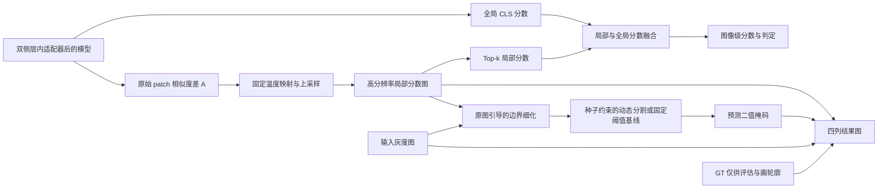

# 异常检测后处理与四列结果图修改方案

适用项目：`D:\图神经网络\小样本原型学习\PA-clip新设计2\paclip`  
核对日期：2026-10-04  
状态：实施方案，尚未修改训练、推理或绘图代码。文中的新增函数、参数和命令均为待实现接口。

本次讨论补充：针对正常图误报与弱病灶漏检的取舍，推荐将“固定种子阈值 + 受上下限约束的逐图边界阈值”作为候选方案，详见第 12 节。原单阈值方案保留为基线；两者需要在相同验证集/测试集上比较后决定正式默认方式。没有设定未经验证的实际阈值。

## 1. 结论与本次目标

用户提供的流程图后半部分，目前只实现了一部分：已有局部异常分数图、CLS 图像分数，以及用于显示的引导滤波上采样；还没有统一接入正式推理的 Top-k 局部池化、局部与全局分数融合、可导出的二值病灶掩码，以及四列多行结果图。

本次建议补全两条输出：

1. 图像级：高分辨率局部分数图 → Top-k 池化 → 与具备使用条件的全局分数融合 → 图像级分数和判定。
2. 定位级：高分辨率局部分数图 → 图像引导的边界细化 → 固定种子阈值与受限动态边界阈值 → 二值预测掩码；固定单阈值作为对照。

最终按用户示例输出：**原图 / 热图 / 热图 + GT / 细化预测掩码 + GT**，每行一个样本，多行组成一页。

第一阶段主要是推理、评估和结果导出改造，可以使用现有 checkpoint。双侧层内 Adapter、sentence 提示词和正常与异常合计 K 的支持集口径继续沿用。胸腺瘤若要加入经过监督训练的全局分类分支，则需要第二阶段补充数据与训练，不能只改绘图函数来完成。

## 2. 当前代码实际实现情况

以下位置按本次检查时的文件记录，后续编辑后行号可能变化，应优先按函数名定位。

| 功能 | 当前状态 | 代码依据 | 本次需要做什么 |
|---|---|---|---|
| 文本和视觉层内适配器 | 已有 | `model.py` 的图像编码与已接入的层内适配器 | 保留，不为补图重复添加网络 |
| patch 异常图 | 已有 | `text_side_anomaly/model.py:732`，`forward()` | 保留 `anomaly_map` 原始定义 |
| 全局图像分数 | 已有输出 | 同函数返回 `cls_probs` | 检查训练条件后决定是否参与融合 |
| 高分辨率热图 | 已有显示实现 | `text_side_anomaly/visualize.py`，`upsample_guided()`、`render()` | 将数值后处理与显示上色分开 |
| Top-k 病灶分数池化 | 正式推理中没有 | 脑部 `_predict()` 只收集 `cls_probs` | 新增不依赖 GT 的局部池化 |
| 局部与全局联合分类 | 没有完整接入 | `text_side_anomaly/train.py:442`，`_predict()` | 增加 `score_local`、`score_fused` |
| 边界细化 | 有显示用引导滤波，没有正式预测掩码链路 | `visualize.py` 文件说明明确为纯显示层 | 数值输出进入阈值、掩码和评估 |
| 二值病灶区域 | 没有统一导出 | 当前主要保存异常图和叠加图 | 保存 `pred_mask`，供出图与 Dice/IoU 共用 |
| GT 叠加 | 已有 | 胸腺瘤 `overlay_heatmap_with_gt()`；脑部 `_display_gt()` | 保留语义并统一二值值域处理 |
| 四列多行图 | 没有 | 目前主要逐张保存单幅 overlay | 新增统一拼图器 |

特别区分以下几个现有的 Top-k：

- `analyze_thymoma.py` 的 Top-k 命中率，k 来自 **GT 病灶 cell 数量**。这是评估诊断，不能当作部署时的池化算法。
- `prepare_thymoma_slices.py` 的 `TOPK=8`，是利用标注选择病灶切片，作用于数据准备。
- 本方案的 Top-k 是**同一张预测分数图中最高的一部分像素**，不读取 GT，和小样本 `K` 也不是同一个参数。

### 2.1 “全局 Proto-Adapter 分数”应如何落到当前代码

现有 `cls_probs` 是 CLS 图像特征与多层正常/异常文本锚点匹配后得到的分数。代码中没有单独命名的“支持集视觉原型分类器”。因此，本次默认将流程图中的全局输入映射到现有 CLS—文本锚点分支，不凭图中名字再添加一个无定义的新模块。

建议框架图写成“全局 CLS—文本锚点分数”和“局部 Top-k 分数”，两者进入“分数融合”。Top-k 的结果不再经过文本/视觉 Transformer Adapter。

如果论文中的 Proto-Adapter 特指由支持集构建视觉原型、再进行特征适配的独立模块，应另写该模块的原型构建、训练损失和推理定义；当前代码不能宣称已经实现了这一种结构。

### 2.2 胸腺瘤全局分支的限制必须保留

当前 `thymoma_local.py` 和 `fewshot_run.py` 中 `w_global=0`。原始胸腺瘤数据准备脚本提取的是有病灶切片，数据说明也明确没有正常病例。

这意味着：

- CLS 数值可以输出，但没有受到正常/异常图像级二分类损失的直接监督，不能默认当成可靠的全局分类器。
- 旧胸腺瘤 checkpoint 第一阶段使用 `score_mode=local_topk`，全局融合权重为 0。
- 脑 MRI 的 checkpoint 在确认有全局监督训练记录、并有包含正常和异常的独立验证集后，可以启用融合。
- 对训练来源不明的旧 checkpoint，先走局部分数，记录原因；显式要求使用全局融合但无法确认条件时，给出明确错误。
- 示例图中 `y=0` 只是该切片没有病灶，不自动等于正常患者。不能由示例推断当前胸腺瘤训练数据已经包含正常病例。

## 3. 推荐的数据流



这里 Top-k 从边界细化之前的高分辨率连续图取值，与用户流程图的两条分支一致。第一版不要在不同入口里有的池化原始图、有的池化细化图。

### 3.1 数值定义

设 `A` 为模型当前返回的 `anomaly_map`，一般为 `14×14`：

```text
A = Σ_l softmax(fusion_weights)[l] × (patch·abnormal_anchor_l − patch·normal_anchor_l)
T = checkpoint 中模型的 temperature，要求 T > 0
P_low = sigmoid(A / T)
P_high = bilinear_resize(P_low, inference_height, inference_width)
P_refined = clip(guided_filter(gray01, P_high, radius, eps), 0, 1)
```

`P_low` 使用与二分类相似度 logits 一致的温度，把相似度差转换成 0～1 分数，方便与 `cls_probs` 融合。**0～1 分数不等于已经校准的异常概率**，仍需在验证集上确定操作阈值；不能预设 0.5 就是最优阈值。

禁止把显示用的逐图 min-max、分位数拉伸或 RGB 热图反算结果送入这些公式。已有 `AmapCalibration` 仍属于显示工具，不成为正式分类/分割的输入。

第一版工作分辨率固定为模型输入分辨率，当前通常为 `224×224`。这属于对低分辨率预测的上采样和图像引导细化，不应描述成模型原生预测了更高分辨率细节。若后续要输出原始 512×512 等尺寸，应增加显式几何映射记录，并单独验证。

### 3.2 Top-k 局部池化

采用比例 `topk_ratio=q`，建议首轮固定 `q=0.05`：

```text
values = P_high[valid_roi]        # 默认 valid_roi 是整幅图
N = len(values)
k_pixels = min(N, max(1, ceil(q × N)))
score_local = mean(largest(values, k_pixels))
```

实施约束：

- 参数名使用 `topk_ratio`，不复用训练 `--k`、`--n-support`。
- `q` 必须满足 `0 < q <= 1`；不能使用 GT 面积决定 `k_pixels`。
- `valid_roi` 如果开启，只能来自图像或独立组织分割结果，不能来自病灶 GT。
- 默认 ROI 关闭，先建立稳定对照。现有强度阈值 ROI 只近似前景，不能直接称为脑实质或纵隔 ROI，也可能漏掉低信号组织。
- 空 ROI 回退整幅图并在逐样本结果中记下 `roi_fallback=true`，不能计算空均值。
- NaN/Inf 应报错定位样本，不要静默变成 0。
- 比例保证尺寸改变时选择的面积比例大体一致，但不保证不同分辨率池化结果完全相等，因此工作尺寸仍需固定并入实验配置。

### 3.3 图像级融合和判定

```text
score_global = outputs['cls_probs']
score_fused = global_weight × score_global + (1 − global_weight) × score_local
pred_label = score_fused >= image_threshold
```

推荐起步配置：

| 场景 | 模式 | global_weight | 条件 |
|---|---|---:|---|
| 旧胸腺瘤定位 checkpoint | local_topk | 0 | 直接使用现有局部模型 |
| 有全局监督记录的脑 MRI checkpoint | fusion | 0.5 | 在独立验证集比较 CLS、Top-k、融合三种分数 |
| 来源或全局监督状态不明 | local_topk | 0 | 输出选择原因，不能自动推断已训练好 |
| 后续重训胸腺瘤完整分类模型 | fusion | 验证集确定 | 有正常/异常图像，且全局损失开启 |

上述 0.05、0.5 是实现起点，尚未通过真实数据证明最优。第一轮不要同时大范围搜索 q、融合权重、滤波参数和形态学参数，避免小验证集过拟合。

没有可用图像阈值时，保留连续分数，`pred_label=null`。不能根据测试图标签决定是否显示红色病灶。

### 3.4 边界细化与二值掩码

两种方式共享上采样与引导滤波。固定单阈值基线顺序为：

```text
P_high → guided filter → P_refined → >= pixel_threshold → optional cleanup → pred_mask
```

本次推荐比较的候选方式为：

```text
P_refined → 检查是否存在达到固定 seed_threshold 的像素
          → 没有：输出有效的全零预测掩码，状态 no_seed
          → 有：计算受限动态边界阈值，保留连接到种子的候选区域
```

动态规则、参数选择和失效情况见第 12 节；不把每张图动态求出的阈值大小本身当成是否有病灶的证据。

初始参数采用已有实现的 `radius=4`、`eps=1e-3`。直接复用/迁移现有纯数值引导滤波，不调用会做色阶标定和上色的 `render()`。

第一版 `cleanup=none`，保留小病灶。随后可增加以下独立开关做消融：

- 8 邻域连通分量，删除面积小于 `min_component_ratio × H × W` 的小岛。
- 只填充面积不超过指定上限的小孔洞，填充后再与有效 ROI 相交。
- 两项默认阈值均为 0，表示关闭。启用时必须把参数纳入阈值选择和实验标识。
- 不默认仅保留最大连通域，也不默认做腐蚀/开运算，避免删除多发或微小病灶。

第一版**不启用图像分类结果对掩码的硬门控**：即使图像被判为正常，局部红色预测仍如实显示，便于发现假阳性。以后若增加“判正常则清空掩码”，必须作为单独推理策略，同时报告门控前后指标，不能只在出图时清空。

固定模式没有像素阈值，或动态模式缺少种子阈值/边界下限时，仍能输出连续热图，但不能伪装成已经完成分割。第四列标注 `Mask unavailable: threshold missing`；也可由用户显式提供预览参数并记录 `source=preset`。参数齐全但没有种子的全零掩码是有效预测，应正常参与指标，不能与参数缺失混淆。

## 4. 数据接口：让预测、评估和图片读取同一份结果

### 4.1 数据集需要补充的字段

在保留训练当前 `image`、`mask` 等字段的同时，增加或通过独立的评估包装器提供：

| 字段 | 格式 | 用途 |
|---|---|---|
| `gray01` | float32，H×W，0～1 | 引导滤波和四列原图，避免每处反推 CLIP 标准化 |
| `gt_mask_high` | bool，H×W | 正式高分辨率评价和绿色轮廓 |
| `gt_available` | bool | 区分未标注与明确空掩码 |
| `sample_id`、`case_id` | string / nullable | 样本追踪、患者隔离与统一抽图 |
| `slice_z`、`modality` | int / nullable | MRI 原图、分数图和 GT 必须来自同一切片/通道 |
| `geometry` | dict | 工作尺寸、原图尺寸及任何旋转/裁剪/缩放信息 |

注意 Windows DataLoader 默认 collate 不接受任意 `None` 嵌套字段。可以采用固定结构 + 有效位，或提供模块顶层的专用 collate，不能使用无法被 spawn 序列化的局部 lambda。旧训练路径不需要这些字段时，应保持原有 batch 兼容。

### 4.2 胸腺瘤与 MRI 的具体读取方式

**胸腺瘤 `.npz`：**优先直接使用已有 `image` 和 `mask224`。`mask` 的 14×14 网格继续用于旧训练和基线评价，不能把它放大后当作精细 GT。旧预处理的 `mask224` 使用过双线性插值后阈值，本次不要静默改写既有数据；若重建为最近邻版本，应升级数据版本、保存来源，并重新生成对应评估。

**二维 MRI：**从原始 mask 路径读取、先转 bool，再采用最近邻几何变换对齐工作尺寸。支持原始 0/1、0/255 掩码。不要继续依赖 `>127` 来识别所有原始 mask，否则 0/1 图像会消失。

**三维/四维 MRI：**沿用支持集已保存的 z 和 modality；评估 z 由评估协议固定，不利用测试病灶 mask 选片。GT 必须取相同 z；不得图像取 z=20 而轮廓取中间层。当前中间切片诊断模式仍应标注为切片级结果，不能因此宣称完成全体积定位。

没有 GT 的样本：`gt_available=false`，其高分辨率 mask 即使为占位全零，也不能进入分割指标。明确标注为正常的切片可以有真实的全零 GT，二者在图例与结果表中区分。

### 4.3 统一逐样本预测结果

建议新增 `PredictionResult`，至少包含：

```text
sample_id, case_id, slice_z, modality
raw_map                  # 模型的原始相似度差，小网格
score_map_high           # 连续上采样分数，供 Top-k 与第 2/3 列使用
score_map_refined        # 引导滤波后的连续分数，供细化掩码和 pxAUROC 使用
pred_mask                # bool；没有阈值时不存在
score_global, score_local, score_fused, score_mode
pred_label               # 没有图像阈值时为 null
roi_fallback
postprocess_id, threshold_id
```

GT 与真实标签放在评估/显示记录中，**不作为 `postprocess_one()` 的入参**。移除或替换 GT 后，三个分数、连续图和预测掩码必须完全不变。

## 5. 文件修改清单与接口建议

### 5.1 新增 `text_side_anomaly/postprocess.py`

职责：模型输出到连续分数、二值掩码，不做文件读取和上色。

```python
@dataclass
class PostprocessConfig:
    version: str = 'post_v1'
    score_mode: str = 'local_topk'
    topk_ratio: float = 0.05
    global_weight: float = 0.0
    refine_method: str = 'guided'
    guided_radius: int = 4
    guided_eps: float = 1e-3
    roi_mode: str = 'none'
    min_component_ratio: float = 0.0
    max_hole_ratio: float = 0.0

def topk_pool(score_map, ratio, roi=None): ...
def refine_score_map(score_map_high, gray01, config): ...
def make_prediction_mask(score_map_refined, pixel_threshold, config, roi=None): ...
def fuse_image_scores(score_global, score_local, config): ...
def postprocess_one(raw_map, score_global, gray01, temperature,
                    config, thresholds, roi=None): ...
```

函数应校验二维形状、有限值、参数范围及 temperature。纯数值引导滤波可从 `visualize.py` 迁移到本模块；旧 `visualize.py` 再导入它以保留兼容。避免推理模块反向依赖 matplotlib/PIL 上色代码。

### 5.2 新增 `text_side_anomaly/inference.py`

职责：一次模型前向，缓存原始输出，统一调用后处理，供脑 MRI、胸腺瘤和独立出图入口共用。

建议接口：

```python
def collect_raw_predictions(model, loader, anchors, device): ...
def apply_postprocess(raw_records, config, thresholds, temperature): ...
def fit_operating_points(validation_records, post_config, model_metadata): ...
def export_predictions(records, output_dir, manifest): ...
```

验证集缓存一次原始预测后再选择阈值；测试集只使用冻结的设置。各入口不再各自复制一套 sigmoid、Top-k、阈值和形态学逻辑。

### 5.3 修改 `text_side_anomaly/visualize.py`

新增 `render_four_panel()` 和 `save_contact_sheet()`，输入已保存的预测结果及显示配置。函数内部不得重新做推理、选阈值、拟合归一化、用 GT 修改预测。

GT 轮廓统一先转 bool，再求边界、最后着色；停止依赖 `FIND_EDGES > 30` 与调用方必须传 0/255 的隐式约定。无病灶的全零 GT 不应被当作错误警告。

旧的 `AmapCalibration`、`render()` 保留给历史图。新图默认使用 `score_map_high` 直接映射统一的 0～1 色阶；显示对比度如需增强，使用预先固定的 vmin/vmax，写入图例，不能逐图自动拉伸。

### 5.4 修改脑部 `text_side_anomaly/train.py`

- `_predict()`：改为收集统一结果，保留原始分数用于基线对照；对旧调用方提供兼容包装，避免无声改变 tuple 含义。
- `_select_thresholds()`：从同一后处理配置下的验证结果确定阈值。
- `_score_split()`：同时输出旧 patch 基线和新版工作分辨率指标，并显式注明图像分数类型。
- `_save_heatmaps()`：从预测缓存读取，写四列图与分页总览，不再重新跑模型并只截取前 32 张。
- `run_experiment()`：把后处理和阈值产物写入评估元数据；旧状态 `visualized` 不代表新版四列图已经存在。
- 新出图流程不再用当前显示样本/测试标签拟合正式分数或阈值。现有显示标定可以作为 legacy 功能保留。

### 5.5 修改胸腺瘤 `thymoma_local.py`、`fewshot_run.py`

- `evaluate()` 目前走 14×14 分数且调用 `pixel_metrics()` 的旧默认阈值搜索。新增正式评估协议：在 val 固定阈值，在 test 计算实际掩码指标。
- `save_heatmaps()` 改为调用统一四列渲染器，`n=6` 的单幅导出扩展为可指定样本清单和每页行数。
- 第一阶段旧 checkpoint 使用 `local_topk`。结果里继续保留 `score_global` 作为诊断字段，但它不参与最终判定。
- 当前旧协议 `test_oracle_dice_v1` 作为历史字段保存，不能被新指标覆盖后继续叫同一个协议。
- 后处理配置变化只重新评估，不应触发重复抽取 K 支持集或重训网络。

### 5.6 修改独立出图 `generate_heatmaps.py`

- checkpoint 出图继续按其记录恢复网络结构和提示词，不硬编码胸片、胸腺瘤或脑部提示词。
- 增加 `--task brain_mri|thymoma` 和 `--data-format slice|volume|thymoma_npz`，路由到对应数据读取器；不能把胸腺瘤 `.npz` 送入 `Image.open()`。
- 新流程必须提供 checkpoint 和后处理/阈值配置；不提供 checkpoint 的肺炎训练演示留在显式 demo 路径，避免出图时意外训练。
- 去除新版路径中现有 `score < 0.5` 会压暗热图的显示门控。两列热图应真实呈现同一局部图。
- 支持读取已导出的预测结果，仅重新排版，不必再次加载 CLIP。

### 5.7 修改数据集、指标和批量入口

- `dataset.py`、`thymoma_dataset.py`：提供第 4 节定义的高分辨率图像/GT/几何信息，保留旧训练字段。
- `metrics.py`：新增针对最终 bool 掩码的 Dice/IoU 汇总，不以 RGB 热图或形态学前阈值图代替。
- `brain_fewshot_run.py`、`fewshot_run.py`：转发后处理和报告参数，聚合结果增加 score_mode、metric_protocol、postprocess_id。
- `README.md`：区分旧 patch 指标、新高分辨率指标，以及显示色阶和预测阈值；同步示例命令。

本阶段 `model.py` 的 `forward()` 输出契约和训练损失可保持不变，避免为后处理改造影响已验证的层内适配器逻辑。

## 6. 四列多行结果图的明确规范

### 6.1 每列内容

| 列 | 标题 | 绘制内容 | 禁止行为 |
|---|---|---|---|
| 1 | Original | 原始窗化/归一化灰度图；样本 ID、z、真实标签（若有） | 不重复归一化改变组织外观 |
| 2 | Heatmap | 原图 + `score_map_high` 热图 | 不叠加 GT，不按图像分数压暗 |
| 3 | Heatmap + GT | 与第 2 列完全相同的底图，再加绿色 GT 轮廓 | 不另算热图，不按 GT 区域截断分数 |
| 4 | Refined mask + GT | 灰度原图 + 半透明红色 `pred_mask` + 绿色 GT 轮廓 | 不用 GT 代替预测，不从热图颜色提取掩码 |

第四列不再铺整幅蓝色热图；这样红色预测区域与绿色真实轮廓能直接比较。绿色轮廓最后绘制，避免被红色遮盖。

示例排版：

```text
页头：任务 / checkpoint 简称 / K / seed / score_mode / 图例
Original                 Heatmap           Heatmap + GT       Refined mask + GT
sample A, y=1, z=44       连续热图 A        热图 A + 绿线      红色预测 A + 绿线
sample B, y=1, z=47       连续热图 B        热图 B + 绿线      红色预测 B + 绿线
sample C, y=0, z=40       连续热图 C        热图 C             红色假阳性（如果有）
页脚：色阶 / 像素阈值及来源 / 全局与局部分数说明 / 页面编号
```

### 6.2 尺寸和外观

- 黑色画布、浅色标题，沿用示例风格。
- 原图面板建议 256×256；这只是显示尺寸，预测与指标仍使用固定工作尺寸。
- 列间距 8 px，行间距 10 px；每行标题区至少 32 px。长 ID 换行或显示短 ID，完整信息保存在结果表。
- 默认每页 8 行、固定 4 列；同时导出每个样本的单行四联图，便于论文选图。
- 统一使用 `jet` 以贴近示例，热图透明度初值 0.45；红色掩码透明度 0.35；GT 轮廓在工作尺寸上约 1～2 px。
- 所有页面共享色阶，并提供唯一色条；色条标注“局部异常分数”，不能写“患病概率”。
- 二值掩码与 GT 放大显示采用最近邻，连续热图可双线性；四列使用相同空间变换，不得只旋转其中一列。
- 额外的 `global/local/fused` 数值放在行标题或旁注中，避免覆盖病灶。
- 无 GT 时第 3/4 列明确写 `GT unavailable`；有真实全零 GT 时写 `GT empty`。
- 没有阈值或无有效掩码时第四列给出原因，不以全黑图伪装成“预测正常”。

### 6.3 抽图规则

跨模型对照应使用同一份 `visualization_manifest.json`，固定 sample_id、case_id、z、modality 和顺序。

若没有指定清单，默认按 case_id/sample_id 稳定排序、优先每个患者一张，固定数量后保存清单。需要像示例那样正常和异常都展示时，可显式启用按真实标签分层的报告抽样，但必须标注这是展示抽样；不能影响推理和指标。

正式指标始终计算完整预定测试集。禁止只挑最好的 Dice、最红的病灶或模型预测正确的图作为默认导出规则。

## 7. 阈值与评估协议

### 7.1 操作顺序

1. 按既有患者划分确定 train/support、val、test，并保留前几轮已实现的 checkpoint 支持集重叠检查。
2. 固定 checkpoint、prompt snapshot、temperature、工作分辨率、Top-k、融合和细化配置。
3. 对 val 生成统一连续预测。
4. 只在 val 上确定图像阈值与分割规则参数，保存配置及数据摘要：固定模式选择像素阈值；动态模式选择固定种子阈值、边界下限，并冻结逐图计算算法。
5. 冻结设置后评估 test，导出预测结果。
6. 由导出的预测结果排版四列图。

开启连通域/孔洞清理时，像素阈值应按“阈值 → 清理 → 最终掩码”的完整链路在 val 上选择。不能先在未清理图上找阈值，却将清理后的 Dice 当成该阈值的验证目标。

动态模式中，在测试图上按冻结算法计算一个边界阈值属于推理步骤，不等于利用测试标签调参。禁止看完测试 GT 后改动算法、阈值下限或种子阈值。

可先使用固定候选阈值网格，例如 0～1 的 256 个点，加上允许空预测的端点，对验证集累计最终掩码 Dice。候选表、评分方式和并列规则必须固定。大数据按图累计 TP/FP/FN，避免堆叠每个候选的全量布尔张量。

图像阈值复用 `choose_image_threshold()`，输入必须是本次最终 `score_fused`。验证集单类别或无标注时，不自动借用测试集选择阈值；允许用户提供显式阈值并记录来源。

### 7.2 指标字段建议

```text
baseline_patch:
    raw_pixel_auroc
    dice_oracle / iou_oracle             # 仅历史协议需要时显示
    grid_shape
image:
    score_mode
    global_auroc / local_auroc / fused_auroc
    fused_ap / fused_f1 / fused_acc
    threshold / threshold_source
pixel_highres:
    auroc_bilinear                       # 连续 P_high
    auroc_refined                        # 连续 P_refined
    dice_micro / iou_micro               # 最终 pred_mask
    dice_macro / iou_macro               # 可选逐样本平均
    normal_false_positive_area_ratio
    threshold / threshold_source
    work_shape / gt_version / roi_mode
```

要求：

- pxAUROC 使用连续图，不能把 bool 掩码当连续分数。
- Dice/IoU 使用第四列的实际预测掩码，不能再次在 test 找最优阈值。
- 原 14×14 指标与 224×224 指标不能直接混为一列宣称提升。对比时同一 GT、分辨率和数据划分必须一致。
- 缺失 GT 不参与分割指标。逐样本 pred 与 GT 同时为空时可约定 Dice/IoU=1，并单独报告正常样本假阳性率；仅一者为空时为 0。汇总方式必须记入协议，避免大量正常图抬高宏平均。
- 全部评估样本仅一个图像类别时，图像 AUROC 标为不可计算并附原因。无病灶切片也不应凭空产生有效的病灶召回率。
- 阈值为空时只报告可计算的连续分数指标，离散指标为 null 并说明原因。
- 不因为改成四列图就声称模型准确率提高。分数融合、边界细化的效果必须由固定协议比较确认。

## 8. 配置、缓存和产物

### 8.1 新增参数建议

| 参数 | 起步值 | 说明 |
|---|---|---|
| `--postprocess-config` | 可选 JSON 路径 | 保存正式后处理配置；CLI 冲突时明确报错或按文档规定覆盖并记录 |
| `--score-mode` | 按模型能力确定 | `local_topk` / `fusion` / `cls_baseline` |
| `--topk-ratio` | 0.05 | 与少样本 K 独立 |
| `--global-weight` | 胸腺瘤旧模型 0 | fusion 模式验证后采用 |
| `--refine-method` | guided | `none` 用于消融 |
| `--guided-radius` | 4 | 工作尺寸上的像素半径 |
| `--guided-eps` | 0.001 | 引导滤波正则项 |
| `--roi-mode` | none | 前景 ROI 后续单独验证 |
| `--min-component-ratio` | 0 | 删除小岛，默认关闭 |
| `--max-hole-ratio` | 0 | 填小孔，默认关闭 |
| `--mask-mode` | fixed，或显式启用 adaptive_seeded | 固定单阈值基线 / 第 12 节候选方案 |
| `--seed-threshold` | 未设定 | 动态模式的统一种子分数下限，需要验证集选择 |
| `--grow-floor` | 未设定 | 动态模式的边界阈值下限，不能大于种子阈值 |
| `--adaptive-method` | otsu，候选方案 | 算法与直方图设置需冻结并写入配置 |
| `--thresholds-file` | 可选 JSON 路径 | 正式出图复用已冻结阈值 |
| `--layout` | four_panel | 单样本四联图和多行分页图 |
| `--rows-per-page` | 8 | 仅影响排版 |
| `--panel-size` | 256 | 仅影响显示尺寸 |
| `--visualization-manifest` | 可选 JSON 路径 | 固定展示样本和顺序 |

已有 `--image-threshold`、`--pixel-threshold` 继续支持。旧原始相似度阈值不能直接拿来阈值化新版 0～1 图，需要明确 `score_space=raw_margin` 或 `post_v1_probability_score` 并检查匹配。

### 8.2 产物目录

建议在已有训练 run 下增加独立评估目录，避免修改颜色/阈值触发训练：

```text
<training_run>/
  checkpoint_final.pt
  support_manifest.json
  evaluations/
    <evaluation_id>/
      postprocess_config.json
      thresholds.json
      evaluation_manifest.json
      metrics.json
      predictions.jsonl
      arrays/
        <sample_hash>.npz
      masks/
        <sample_hash>_pred.png
      figures/
        <render_id>/
          visualization_manifest.json
          display_config.json
          rows/<sample_hash>.png
          overview_001.png
          overview_002.png
```

每个 `.npz` 保存 raw_map、score_map_high、score_map_refined、可用时的 pred_mask，使用纯数值数组，读取无需 pickle。大数据按图流式写出；分页图每次只组装一页，不将全量高分辨率结果留在内存。

`predictions.jsonl` 存三个分数、阈值、判定、GT 是否可用、mask 路径与样本身份。文件名使用包含 sample_id、z、modality 的稳定摘要，不能只把路径分隔符替换成下划线，避免不同路径或不同切片覆盖。

### 8.3 三层标识

1. `training_id`：沿用当前 K、seed、prompt、Adapter 和训练步数标识。
2. `evaluation_id`：由 checkpoint SHA、提示词内容摘要、数据/GT 版本与划分、几何处理、后处理配置、阈值文件内容摘要生成。
3. `render_id`：由 evaluation_id、样本清单、布局、显示尺寸、配色和色阶生成。

`thresholds.json` 还需记录拟合 checkpoint SHA、val 摘要、postprocess 配置摘要、分数空间和拟合目标，加载时逐项校验。换 checkpoint 后不能误用另一模型的阈值。

换 q、融合权重或细化参数需要新评估；只换每页行数只需重新排版。缓存完整性需检查产物清单，不能仅凭 heatmaps 目录存在就认定导出完成。

## 9. 胸腺瘤若要完整启用全局分支，另需哪些工作

这一部分属于需要重新训练的第二阶段，不能与第一阶段后处理效果混在一起。

1. 明确任务单位：切片级“这一层有无病灶”，还是患者级“有无胸腺瘤”。当前框架主要输出切片级结果。
2. 若使用胸腺瘤患者的无病灶切片作负样本，只能支持切片级实验，并且所有同患者切片仍必须在同一划分。
3. 若要患者级诊断能力，需要患者级正常/异常数据，不能将有肿瘤患者的无病灶切片当成独立健康病例。
4. 构造包含正常和异常的支持集，K 仍是两类合计数。保留固定支持集、seed 和按患者划分逻辑。
5. 将全局对齐损失纳入训练，与局部损失共同优化；损失权重用验证集确定，记录真实训练值。
6. checkpoint 保存 `global_supervision_enabled`、图像标签定义、类别计数、损失配置和数据划分摘要。
7. 独立比较 CLS、Top-k、融合，再决定是否将融合设为该模型的正式默认值。

在此之前，流程图与实现说明应标注胸腺瘤旧模型“局部评分模式”，不能靠输出一个 CLS 数字宣称全局分支已训练完成。

## 10. 建议实施顺序与验收

### 第一批：统一数值后处理

实现 `postprocess.py`；读入现有 raw_map 和灰度图即可验证。加入 Top-k、固定温度映射、引导细化、阈值掩码，先不加入形态学。

验收：预测完全不依赖 GT；q=1 等于全图均值；单像素/空 ROI/非有限数可明确处理；修改小样本 K 不影响 Top-k 参数的定义。

### 第二批：统一推理、阈值与指标

补全高分辨率 GT 接口，接入脑部和胸腺瘤入口。保留旧指标，新增正式验证集阈值协议和最终掩码指标。

验收：同一 checkpoint、同一输入、同一配置，通过训练入口评估与独立出图入口得到相同分数和掩码。测试标签被替换时预测不变。旧胸腺瘤 checkpoint 自动落到 local_topk，不能隐式开启不可靠的全局融合。

### 第三批：四列图和分页总览

直接读第二批导出的结果进行绘图，完成每样本四联图及 8 行一页总览。

验收：第 2/3 列除 GT 轮廓外逐像素一致；第 4 列红色区域等于导出的预测掩码；GT=0/1 与 GT=0/255 轮廓相同；未标注与空 GT 显示不同；正常图有假阳性时如实显示。

### 第四批：小规模真实数据验证

先固定同一 checkpoint 和样本清单比较：

| 对照 | 图像评分 | 定位 | 目的 |
|---|---|---|---|
| A | 原 CLS，仅具备条件时 | 旧 14×14 raw 基线 | 保存历史参照 |
| B | Top-k | 双线性高分辨率图 + val 阈值 | 看局部池化及分辨率影响 |
| C | Top-k | 引导细化 + val 阈值 | 看细化收益 |
| D | CLS + Top-k，仅具备条件时 | 同 C | 看融合收益 |
| E，可选 | 同 D 或 C | 加小区域清理，重新在 val 选阈值 | 看清理对小病灶及假阳性的影响 |

优先报告同尺寸、同 GT、同划分下的 B/C/D/E 对比；A 的 patch 指标单独展示。发现改善后再扩大到多个 K 和 seed，避免先跑大批量后才发现图、分数与指标口径不一致。

### 必须覆盖的回归场景

- 旧脑部/胸腺瘤 checkpoint 的网络与 sentence 提示词恢复不变。
- 之前已验证的支持集摘要迁移、独立评估重叠检查、MRI modality 恢复继续通过。
- 三维数据同一 z、同一通道导出正确；两张同名不同路径图片不会覆盖。
- 掩码全空、全前景、多病灶、微小病灶及 GT 缺失。
- 首尾不满一页、多页输出、长文件名、中文路径。
- 新阈值不能套到旧 raw_map 分数空间；改变后处理配置不能复用旧评估缓存。
- 只修改布局不触发训练，也不重新抽支持集。
- 模型输出的 raw_map 不被后处理原地修改，旧训练损失行为保持一致。
- 固定原始预测后，整个报告生成不需要加载 CLIP；单页导出失败不会删除训练产物。

## 11. 完成标准

完成后应能够从一个已有 checkpoint 输出：连续局部分数、可解释的图像级评分模式、冻结分割规则下的二值掩码、与该掩码一致的定位指标，以及用户示例的四列多行图。

第一阶段不预先承诺性能提升，也不把上采样当成新增了网络定位能力。它首先补齐当前缺失的推理结果和统一展示链路；胸腺瘤全局分类分支的监督训练另按第 9 节实施。

## 12. 推荐候选：固定种子下限 + 受限动态边界阈值

### 12.1 用户想法与实施上的区分

“逐图动态调整，低于一个值就不出掩码”的目的，是既适应不同病灶的强弱，又避免正常图必然被分出前景。建议把它拆成两个判断：

1. 有没有像素达到统一的异常种子分数下限？没有则输出空预测。
2. 存在这样的种子时，这张图的边界应延伸到哪里？用受限的动态阈值确定。

不要直接用 `动态阈值 < 某常数` 来整张拒绝。比如绝大部分背景都很低、只有一个小区域很高时，动态阈值可能偏低，但不能因此删除这个小病灶候选。动态阈值反映的是图内分布的分割位置，不是图像异常概率。

这里的“种子”指预测图中的高分像素，没有使用真实病灶位置。种子过滤也不是用当前胸腺瘤未经全局监督的 CLS 分数强行清空整图。

### 12.2 完整规则

设 `P` 是第 3 节的 `P_refined`，取值 0～1；`R` 是有效区域，默认整幅工作图。所有参数作用于这份连续预测，不能作用于 RGB 颜色或逐图 min-max 结果。

```text
T_seed：统一种子阈值，在验证阶段固定
T_floor：边界阈值下限，在验证阶段固定
要求 0 <= T_floor <= T_seed <= 1

seeds = R AND (P >= T_seed)

如果 seeds 为空：
    pred_mask = 全零 bool 图
    mask_status = no_seed
    不再计算动态边界阈值

否则：
    T_dynamic = Otsu(P[R])
    T_grow = clip(T_dynamic, T_floor, T_seed)
    candidates = R AND (P >= T_grow)
    对 candidates 做 8 邻域连通分量划分
    pred_mask = 只保留包含至少一个 seeds 像素的连通分量
    mask_status = predicted
```

这相当于种子约束的双阈值分割。较弱区域只有与高分种子相连才被保留。Otsu 只负责提出图内边界阈值，不负责证明该图存在病灶。

实现应统一使用 `>=` 与 8 邻域，不直接假定第三方默认连接方式或比较符号相同。固定 `nbins=256`；如果使用自定义直方图，固定范围为 [0,1] 并保存 bin 定义。第一版可以使用现成 Otsu 实现，但必须锁定具体算法设置。

先关闭面积删除、孔洞填充和全局分类门控，避免过多参数一起改变。连通分量必须保留所有含种子的区域，不能只保留最大的一个。

### 12.3 直观例子（下列数字仅解释规则，不是项目推荐阈值）

假设为说明算法临时取 `T_seed=0.70`、`T_floor=0.35`：

| 分数情形 | 动态阈值 | 输出 |
|---|---:|---|
| 整图最高分只有 0.28 | 不计算 | 没有种子，输出空掩码 |
| 一个区域中心 0.82，周围边缘 0.48 | 0.40 | 保留中心，以及与其连通且分数达到 0.40 的部分 |
| 一个高分小区域 0.82，绝大多数背景很低 | 0.10 | 实际边界阈值抬到 0.35，不因动态阈值低而整图丢弃 |
| 一个区域中心 0.82，另一个孤立低分区 0.45 | 0.40 | 低分区若不与任何种子连通，则不保留 |
| 弱病灶最高分仅 0.60 | 不计算 | 仍会漏掉，说明种子阈值必须检查弱病灶召回 |

示例不意味着正常图一定低于 0.70，也不意味着真实病灶一定高于它。当前模型可能整体分数偏低，真实参数必须另行确定。

### 12.4 两个固定值如何选

**种子阈值：先利用正常验证图提供误报参照。**

对每张明确无病灶的验证图，计算同一处理流程下有效区域的最大分数 `max(P[R])`。可以从这些“每图最大值”的较高分位数建立候选范围，再看异常验证图上的病灶检出情况。

这里统计每图最大值，是因为出现任何达到种子阈值的区域就可能产生非空掩码。只取全部正常像素的 99% 分位数，不能据此宣称只有 1% 的正常图误报。

正常图分位数仅作为经验起点，不保证未来数据达到同样误报率。样本少、相同患者切片相关性高时尤其需要谨慎解释；按患者划分，报告正常患者数与正常切片数。

**边界下限：在异常验证图上检查覆盖程度。**

固定或小范围改变种子阈值，再比较少量边界下限候选。每组都按完整的“种子 → 动态边界 → 连通分量”流程生成掩码，统计：

- 病灶检出率，单独看微小和低分病灶。
- 正常切片出现任何预测区域的比例。
- 每张正常切片的假阳性区域数和面积。
- Dice/IoU 及异常图内额外误报面积。

病灶级检出的匹配规则必须预先固定，例如规定预测分量与 GT 病灶的覆盖条件，并同时报告重叠指标；不能把一次轻微擦边解释成病灶已被充分分割。

以“可接受的正常图误报水平下，尽量提高病灶检出率”为主要取舍，再比较边界 Dice。若没有一组参数满足目标，保留这个结果并改进模型，不能通过只隐藏红色区域让图看起来更好。

需要正常与异常验证数据。只有病灶切片时，可以比较覆盖与边界，但不能完成对无病灶图误报的验证。少样本实验应单独报告阈值选择使用了多少验证标签；不能一边使用额外大量验证标注，一边宣称总标注预算仅为 K。

### 12.5 与代码、产物和指标的衔接

新增接口建议：

```python
def make_seeded_adaptive_mask(score_map_refined, seed_threshold,
                              grow_floor, roi=None, adaptive_method='otsu'):
    # 返回 mask 和诊断信息；不接收 GT、真实标签或 CLS 判定。
    ...
```

配置新增 `mask_mode`、`seed_threshold`、`grow_floor`、`adaptive_method`、直方图设置和 `connectivity=8`。上述字段都纳入后处理摘要；单阈值模式继续使用现有 `pixel_threshold`，两种模式不得混用参数或缓存。

`thresholds.json` 保存验证集确定的 T_seed、T_floor 及算法配置。每张图的结果额外记录：

```text
max_refined_score
seed_threshold / grow_floor
dynamic_threshold / effective_grow_threshold
seed_pixel_count / candidate_component_count / kept_component_count
mask_status: predicted | no_seed | unavailable
adaptive_status: ok | constant_map | not_run
```

`no_seed` 是有效的全零预测，应计入正常图正确拒绝或异常图漏检；`unavailable` 是参数/输入缺失，不能冒充全零预测计算漂亮指标。

第四列和 Dice/IoU 必须使用同一张最终掩码。第二、三列保留连续热图，即使没有种子也不压暗原始分数。图像级 `pred_label` 仍来自独立的图像评分协议；不要把“没有分割种子”自动改写成确定正常。

这套方法是当前任务的工程候选，性能需要实测。先固定同一 checkpoint 比较：固定单阈值、固定双阈值、本节动态低阈值三种方式。测试 GT 只用于最后评估，不参与逐图阈值计算或事后修改。

### 12.6 退化情况与回归测试

- 常量图低于种子阈值：有效空掩码。
- 常量图达到种子阈值：记录 `constant_map`，采用固定下限作为动态算法退化回退；全有效区域可能被预测为前景，必须如实输出，不能为了好看清空。
- 有种子、动态阈值低于下限：使用下限；高于种子阈值：使用种子阈值。
- 空 ROI：沿用整图回退并记录；NaN/Inf：明确报错定位输入。
- 多个互不相连的高分病灶候选：全部保留。
- 孤立低分噪声不与种子相连：不保留；连接到种子的背景可能仍然扩张过多，这是需要验证的失败模式。
- 相同 P、不同 GT：所有阈值与预测完全一致。
- 同一图经训练后评估入口和独立出图入口：阈值、种子和最终掩码一致。
- 修改参数或 mask_mode：产生新的 evaluation_id；只改变标题或排版不改变预测。

### 12.7 参考依据与适用限制

- [scikit-image：Otsu 阈值示例](https://scikit-image.org/docs/0.25.x/auto_examples/segmentation/plot_thresholding.html)：按图像分布划分两类像素，不提供病灶是否存在的判断。
- [scikit-image：滞后阈值接口](https://scikit-image.org/docs/0.25.x/api/skimage.filters.html#skimage.filters.apply_hysteresis_threshold)：保留高于高阈值的部分，以及与其连接的低阈值区域。

本节将二者组合并加入固定边界下限，是针对当前代码提出的待验证设计，不是已经在本项目上证明有效的方法。无法保证消除正常图高分假阳性，也无法找回所有达不到种子阈值的弱病灶。
